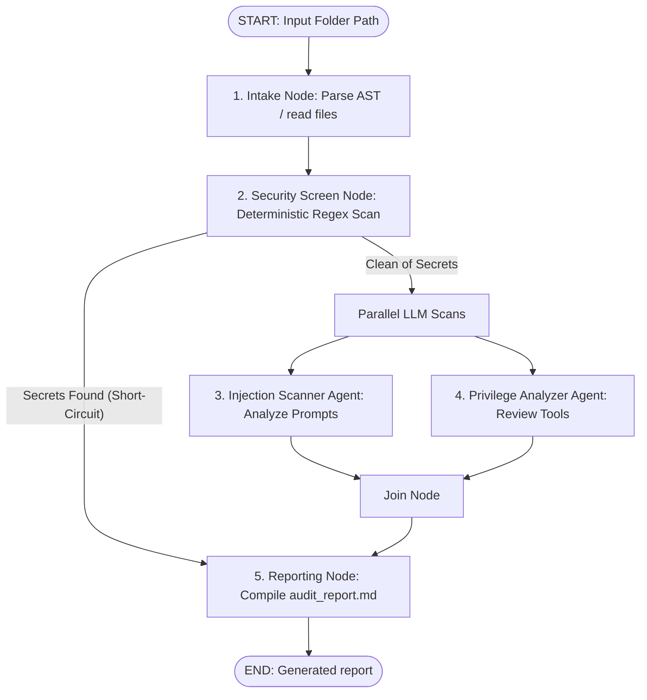

# GuardianLLM Lite (Agentic Security Auditor)

GuardianLLM Lite is an agentic security auditor designed to analyze other AI agent codebases for security vulnerabilities, including hardcoded secrets, prompt injections, and over-privileged tools.

Built on **Agent Development Kit (ADK) 2.0** as part of the Google & Kaggle 5-Day AI Agent Vibe Coding course capstone project, this application showcases multi-agent orchestration, deterministic short-circuiting, and packaging logic into reusable **Antigravity Skills**.

---

## 🏗️ Architecture & Workflow

GuardianLLM Lite operates as a structured workflow graph:



1. **Intake Node (Deterministic)**: Recursively parses the target agent directory to read file contents and extract system instructions, tool definitions, and skill configurations using AST parsing.
2. **Security Screen Node (Deterministic)**: Runs high-fidelity regex patterns to scan the code for hardcoded credentials (API keys, AWS keys, Slack tokens, GitHub tokens).
   - *Short-Circuit Design*: If a secret is detected, it immediately routes to the Reporting Node, bypassing the LLM agents to prevent leaking private secrets into the model context and save token costs.
3. **Injection Scanner Agent (LLM)**: Analyzes the agent's instructions for jailbreak susceptibility, role-play vulnerabilities, and lack of instruction-override defense.
4. **Privilege Analyzer Agent (LLM)**: Inspects the signatures, docstrings, and code of the agent's tools for over-broad filesystem, subprocess, or network capabilities.
5. **Reporting Node (Deterministic)**: Compiles all results into an `audit_report.md` written directly to the target project directory.

---

## 📁 Project Structure

```
guardianllm-lite/
├── app/
│   ├── agent.py               # Core ADK 2.0 graph workflow definition
│   ├── config.py              # Regex patterns and model settings
│   └── agent_runtime_app.py   # Scaffold runner (unused; local runtime prioritized)
├── sample_target_agent/       # A mock agent containing all 4 targeted vulnerabilities
│   └── agent.py
├── tests/
│   ├── conftest.py            # Global test setup (environment loading)
│   └── unit/
│       ├── test_security_screen.py # Unit tests for regex and node routing
│       └── test_agent.py           # Integration tests running the full runner graph
├── .agents/
│   └── skills/
│       └── agent-security-audit/
│           ├── SKILL.md       # Antigravity skill triggers and instructions
│           └── scripts/
│               └── audit.py   # Skill helper execution script
├── pyproject.toml             # Project dependencies and pytest settings
└── .env                       # Gitignored API keys
```

---

## 🛠️ Setup & Installation

### Prerequisites
- **Python**: `3.11`
- **uv**: Astral's package manager ([Install uv](https://docs.astral.sh/uv/getting-started/installation/))
- **agents-cli**: Agents command-line tool (`uv tool install google-agents-cli`)

### Installation Steps

1. **Install Dependencies**:
   ```bash
   agents-cli install
   ```

2. **Configure Environment Variables**:
   Copy `.env.example` to `.env`:
   ```bash
   copy .env.example .env
   ```
   Open the `.env` file and insert your Google Gemini API Key:
   ```env
   GEMINI_API_KEY=your_actual_api_key_here
   ```

---

## 🚀 Execution & Usage

You can run the auditor in three different ways:

### 1. Direct Python CLI execution (Recommended for fast validation)
Run the packaged skill helper script against a target directory.

- **To audit the vulnerable agent** (demonstrates the deterministic secret short-circuit path):
  ```bash
  uv run python .agents/skills/agent-security-audit/scripts/audit.py sample_target_agent
  ```
  *Output*: Immediately completes and generates `sample_target_agent/audit_report.md` showing critical findings with no LLM calls.

- **To audit a clean agent** (demonstrates parallel LLM analysis of instructions and tools):
  ```bash
  uv run python .agents/skills/agent-security-audit/scripts/audit.py app
  ```
  *Output*: Performs LLM scans and generates `app/audit_report.md` showing susceptibility and tool permission analysis.

### 2. Antigravity Skill Natively in the IDE
The skill is located at `.agents/skills/agent-security-audit/SKILL.md` and is automatically discovered by the Antigravity IDE. You can trigger it natively by typing:
- `"audit this agent"`
- `"run a security check on ."`
- `"check my security posture"`

### 3. Interactive Playground
To run the local web server playground:
```bash
agents-cli playground
```
This launches a chat UI. Submit a directory path (e.g., `sample_target_agent` or `app`) as a message, and the playground will return the compiled Markdown report.

---

## 🧪 Testing

### Running Pytest (11 tests)
Our test suite includes 9 unit tests targeting the regex scanner patterns and routing, and 2 async integration tests verifying the full ADK graph runner's end-to-end execution.

Run the test suite:
```bash
uv run pytest tests/unit/
```

*Note on `agents-cli eval`: The standard `eval` commands rely on Vertex AI and Cloud Storage client libraries that require active Google Cloud credentials and billing. In order to honor the local free-tier constraint, this project prioritizes local pytest unit and integration coverage over GCP-dependent CLI evaluations.*
